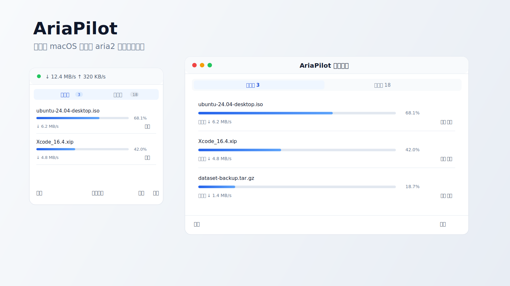

# AriaPilot



AriaPilot 是一个轻量级 macOS 菜单栏工具，用来查看和管理 aria2 下载任务。它通过 aria2 JSON RPC 连接到正在运行的 aria2 实例，适合希望把 aria2 常驻在后台，同时保留一个原生小面板来操作下载任务的用户。

## 功能

### 菜单栏面板

菜单栏面板用于快速查看当前状态和执行高频操作：

1. 查看全局下载和上传速度
2. 查看下载中任务和已完成任务
3. 添加下载链接
4. 暂停、继续、删除任务
5. 打开独立下载任务窗口
6. 打开设置窗口
7. 退出应用

### 独立下载任务窗口

当任务较多时，可以从菜单栏点击“打开窗口”进入独立下载任务窗口。独立窗口支持正常拖拽调整大小，适合长时间管理任务列表。

### 设置窗口

设置窗口支持：

1. 配置 RPC URL 和密钥
2. 检测 aria2 连接并读取运行配置
3. 设置新任务默认下载位置
4. 设置同时下载任务数量
5. 设置新任务连接数
6. 设置全局下载和上传速度限制
7. 配置登录时启动
8. 检查并安装新版本

说明：AriaPilot 的“已完成”列表来自 aria2 RPC 的 `aria2.tellStopped`，它不会扫描下载目录。如果 aria2 没有保留历史结果，列表会显示为空。

## 安装

1. 打开 [Releases](https://github.com/mh567/AriaPilot/releases)
2. 下载最新的 `AriaPilot-vx.x.x-macos.zip`
3. 解压后把 `AriaPilot.app` 拖入“应用程序”
4. 启动 AriaPilot
5. 在设置窗口中配置 aria2 RPC

## aria2 RPC 配置

AriaPilot 需要连接到已经开启 RPC 的 aria2。

本机常见启动示例：

```bash
aria2c --enable-rpc --rpc-listen-all=false --rpc-listen-port=6800 --rpc-secret=123456
```

对应的 AriaPilot 设置：

```text
RPC URL: http://localhost:6800/jsonrpc
密钥: 123456
```

如果 aria2 运行在局域网其他设备上，把 `localhost` 换成对应设备的 IP 地址。

## 历史任务

AriaPilot 的已完成列表依赖 aria2 当前会话中保留的下载结果。若希望 aria2 重启后仍能恢复任务和历史，请根据自己的 aria2 使用方式配置 session 文件，例如：

```bash
aria2c \
  --enable-rpc \
  --rpc-secret=123456 \
  --save-session=/path/to/aria2.session \
  --input-file=/path/to/aria2.session \
  --save-session-interval=60
```

如果配置了 `max-download-result=0`，aria2 不会保留已停止任务结果，AriaPilot 的已完成列表也会为空。

## 应用内更新

设置窗口中提供“检查更新”和“立即更新”。更新来源为 GitHub Releases。下载完成后，AriaPilot 会校验安装包中的 bundle id 和版本号，再替换当前应用并重新打开。

## 开发构建

调试构建：

```bash
swift build
```

发布构建：

```bash
bash build.sh
```

发布构建会生成：

```text
AriaPilot.app
AriaPilot-vx.x.x-macos.zip
```

## 系统要求

1. macOS 13.0 或更高版本
2. aria2 已安装并开启 RPC
3. Swift 5.9 或更高版本，用于本地开发构建

## 项目结构

```text
Sources/AriaPilot/
├── AriaPilotApp.swift
├── ContentView.swift
├── DownloadsWindowView.swift
├── DownloadsWindowController.swift
├── DownloadsListView.swift
├── SettingsView.swift
├── SettingsWindowController.swift
├── AddDownloadView.swift
├── DownloadRowView.swift
├── DownloadManager.swift
├── Aria2Client.swift
├── UpdateManager.swift
├── Models.swift
└── Helpers.swift
```

## 技术栈

1. Swift
2. SwiftUI
3. Swift Package Manager
4. URLSession
5. aria2 JSON RPC
6. ServiceManagement

## 许可证

MIT
